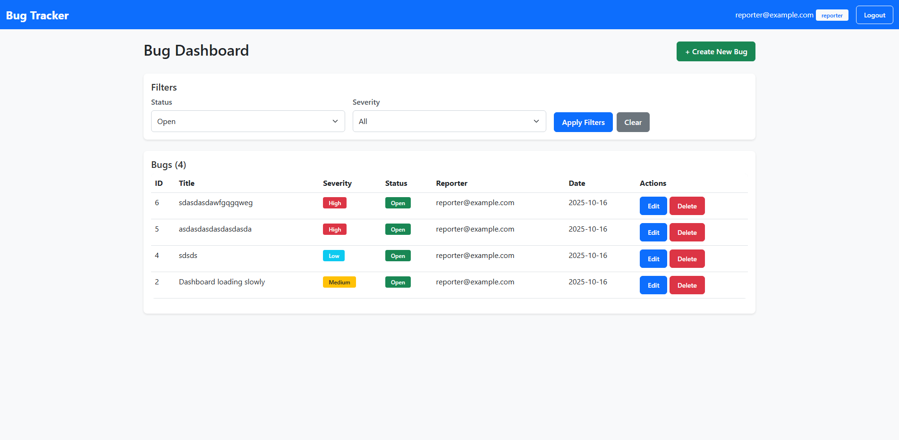

# Bug Tracker QA Workflow

[](https://www.python.org/)
[](https://www.selenium.dev/)
[](https://docs.pytest.org/)
[](https://github.com/Sgtsamurai92/bug-tracker-qa-workflow/actions/workflows/ci.yml)

A complete QA portfolio project that showcases a real-world testing workflow from requirements and manual testing to Selenium automation and CI.



This repository contains:
- A Flask-based Bug Tracker web application (SQLite database)
- A Selenium + Pytest automation suite using the Page Object Model
- GitHub Actions workflow for headless CI test execution
- QA documentation (test plan, RTM, and bug report template)

## Table of Contents

- [Project Overview](#project-overview)
- [Features](#features)
- [Tech Stack](#tech-stack)
- [Project Structure](#project-structure)
- [Quick Start](#quick-start)
- [Running the Application](#running-the-application)
- [Running Tests](#running-tests)
- [Test Reports and Screenshots](#test-reports-and-screenshots)
- [QA Documentation](#qa-documentation)
- [CI/CD Pipeline](#cicd-pipeline)
- [Troubleshooting](#troubleshooting)

## Project Overview

This project demonstrates an end-to-end QA workflow:
1. Requirements and test planning (TEST_PLAN.md, RTM.MD)
2. Manual testing with evidence (manual folder)
3. Automated browser tests (Selenium + Pytest)
4. Continuous Integration with HTML reports and screenshots on failure

## Features

### Bug Tracker Application
- User authentication with roles (Reporter and Manager)
- Create, read, update, and delete bugs
- Filter by status and severity
- Role-based permissions for actions
- Responsive Bootstrap user interface
- **AI-Powered Support Chat**: Embedded support assistant using OpenAI GPT-4o-mini
- **Smart Documentation**: Automatically generates help articles from user questions
- **Help Articles Library**: Searchable collection of user-generated documentation
- **Context-Aware Assistance**: Bot scans codebase and docs to provide accurate answers

### Automation Test Suite
- Page Object Model structure
- Pytest with fixtures and HTML reporting
- Screenshots captured on failure
- Headless execution support for CI (visible by default locally)

## Tech Stack

**Application**
- Python 3.11+, Flask 3.x
- SQLite
- HTML5, CSS3, Bootstrap 5
- OpenAI API (GPT-4o-mini)
- Flask-SQLAlchemy 3.1+

**Automation**
- Selenium 4
- Pytest 7+
- webdriver-manager

**CI/CD**
- GitHub Actions

## Project Structure

```
bug-tracker-qa-workflow/
├─ app/
│  ├─ app.py              # Flask app entrypoint
│  ├─ models.py           # SQLAlchemy models
│  ├─ templates/          # Jinja2 templates (login, dashboard, bug form, help articles)
│  ├─ static/             # CSS and JavaScript (including support chat widget)
│  └─ support/            # AI support chat module (routes, prompts, LLM helper, context builder)
├─ automation/
│  ├─ pages/              # Page Objects (Base, Login, Dashboard, Bug Form)
│  ├─ tests/              # Pytest test cases
│  ├─ reports/            # HTML reports and screenshots
│  ├─ pytest.ini          # Pytest configuration
│  └─ requirements.txt    # App + test dependencies
├─ docs/                  # Application documentation (getting started guide)
├─ help_articles/         # AI-generated help articles (markdown)
├─ manual/                # Manual test artifacts (cases, data, evidence)
├─ README.md
└─ .github/workflows/ci.yml
```

## Quick Start

### Prerequisites
- Windows with PowerShell
- Python 3.11+ installed and on PATH
- Google Chrome installed
- Git installed

### Clone and set up environment

```powershell
# Clone the repository
git clone https://github.com/Sgtsamurai92/bug-tracker-qa-workflow.git
cd bug-tracker-qa-workflow

# (Optional) Create and activate a virtual environment
python -m venv .venv
.\.venv\Scripts\Activate.ps1

# Install dependencies
pip install -r automation\requirements.txt

# Set up OpenAI API key (required for AI support chat)
# Create a .env file in the project root:
echo "OPENAI_API_KEY=your_api_key_here" > .env
echo "SECRET_KEY=your_secret_key_here" >> .env
```

> **Note**: The AI support chat feature requires an OpenAI API key. Get one at [platform.openai.com](https://platform.openai.com). The app will still work without it, but the support chat will be unavailable.

## Running the Application

Start the Flask server on http://localhost:5000

```powershell
cd app
python app.py
```

Keep this terminal open while running tests.

### Default Test Users

| Email                   | Password     | Role     |
|-------------------------|--------------|----------|
| reporter@example.com    | password123  | Reporter |
| manager@example.com     | password123  | Manager  |

### Sample Data
- Database is pre-seeded with a few example bugs of varying severity.

### AI Support Features

Once the app is running with a valid OpenAI API key:

1. **Support Chat Widget**: Click the purple chat bubble (💬) in the bottom-right corner
2. **Ask Questions**: Get instant answers about Bug Tracker features and workflows
3. **Generate Documentation**: The bot automatically creates help articles when it detects knowledge gaps
4. **Help Articles Library**: View all generated documentation at `/help-articles`

The AI assistant:
- Scans the codebase and documentation for accurate answers
- Detects when documentation is missing and proposes new articles
- Provides step-by-step guidance for common tasks
- Stays focused on Bug Tracker features only

## Running Tests

The application must be running first (see previous section).

### Easiest: use the helper script

From the project root, in a new PowerShell terminal:

```powershell
./run_tests.ps1
```

This runs tests with the browser visible by default and opens the HTML report when complete.

### Manual: run Pytest yourself

Use a separate terminal from the Flask app terminal.

```powershell
cd automation

# Run all tests (browser visible by default)
pytest tests/ -v

# Run a specific test file
pytest tests/test_login_valid_invalid.py -v

# Generate an HTML report
pytest tests/ --html=reports/report.html --self-contained-html -v

# Run headless (browser hidden)
$env:HEADLESS = "true"
pytest tests/ -v

# Run in parallel (example: 3 workers)
pytest tests/ -n 3 -v
```

## Test Reports and Screenshots

- HTML report: `automation/reports/report.html`
- Failure screenshots: `automation/reports/screenshots/`

Open the latest HTML report on Windows:

```powershell
start automation\reports\report.html
```

## QA Documentation

- `TEST_PLAN.md` – Test strategy, scope, environment, entry/exit criteria
- `RTM.MD` – Requirements Traceability Matrix (features ↔ tests)
- `BUG_REPORT_TEMPLATE.md` – Standardized bug report format
- `manual/` – Manual test cases (CSV), test data, and evidence
- `docs/` – Application documentation including getting started guide
- `help_articles/` – AI-generated help articles in Markdown format

## CI/CD Pipeline

GitHub Actions workflow runs on each push:
- Installs dependencies and Google Chrome
- Starts the Flask app and runs tests headlessly
- Uploads HTML report and screenshots as CI artifacts

See `.github/workflows/ci.yml` for details.

## Troubleshooting

- Connection refused or tests failing at startup
  - Ensure the Flask app is running at http://localhost:5000 before running tests.
- ChromeDriver/Chrome version mismatch
  - webdriver-manager downloads the appropriate driver automatically; make sure Chrome is installed and up-to-date.
- Port 5000 already in use
  - Stop other processes or change the Flask app port if needed.
- Support chat not working
  - Verify your OpenAI API key is set correctly in the `.env` file
  - Check that `openai` package is version 2.9.0 or higher (`pip install --upgrade openai`)
  - Ensure you have an active internet connection
- Session/login issues
  - Clear browser cookies or use incognito mode
  - Check that `flask_session` directory exists and is writable
- Clean install
  - If dependencies are inconsistent, recreate the virtual environment and reinstall requirements:
    ```powershell
    deactivate  # if active
    Remove-Item -Recurse -Force .venv
    python -m venv .venv
    .\.venv\Scripts\Activate.ps1
    pip install -r automation\requirements.txt
    ```

## Recent Updates

### AI Support Chat Integration (December 2025)
- Added embedded AI support assistant using OpenAI GPT-4o-mini
- Implemented automatic help article generation based on user questions
- Created Help Articles page with search functionality and modal viewer
- Added context-aware support that scans codebase and documentation
- Included 3 initial help articles (Getting Started, Bug Creation, User Roles)

### Bug Fixes and Improvements
- Fixed login redirect loop with proper Flask session configuration
- Upgraded OpenAI SDK to v2.9.0 for compatibility
- Corrected role permissions documentation (Reporters can delete own bugs)
- Added responsive navigation with Help Articles link
- Improved error handling in support chat

---

If anything is unclear or you want to extend the project (API tests, more scenarios, additional roles), feel free to open an issue or contribute.
